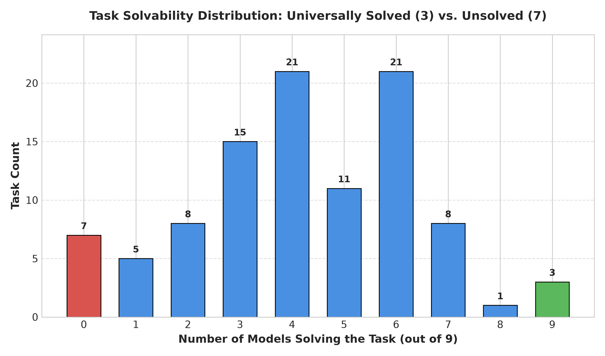
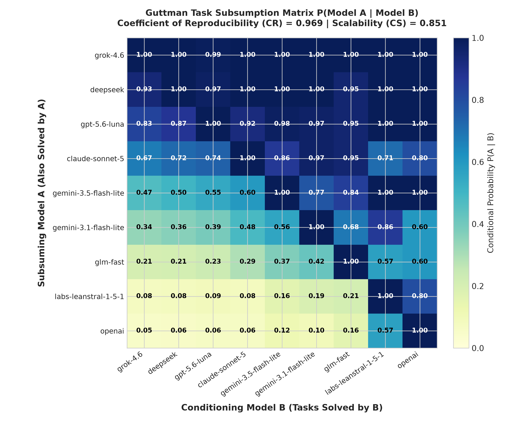
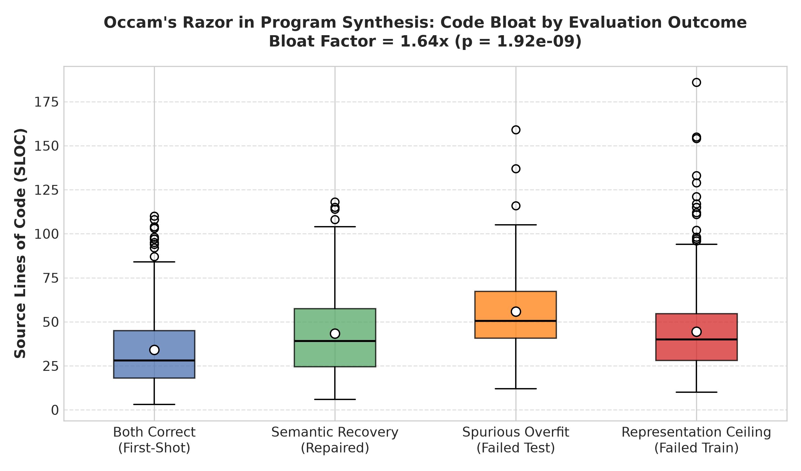
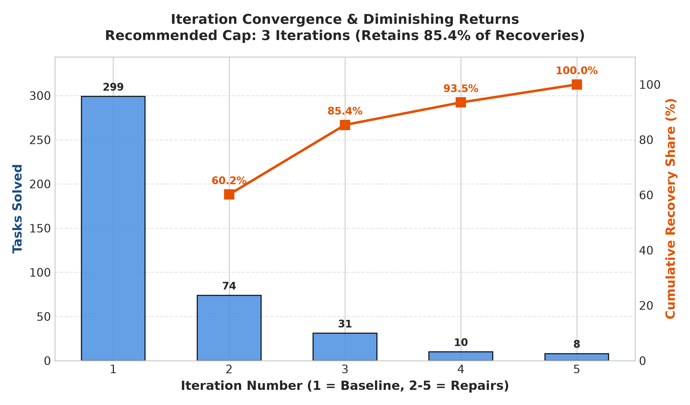
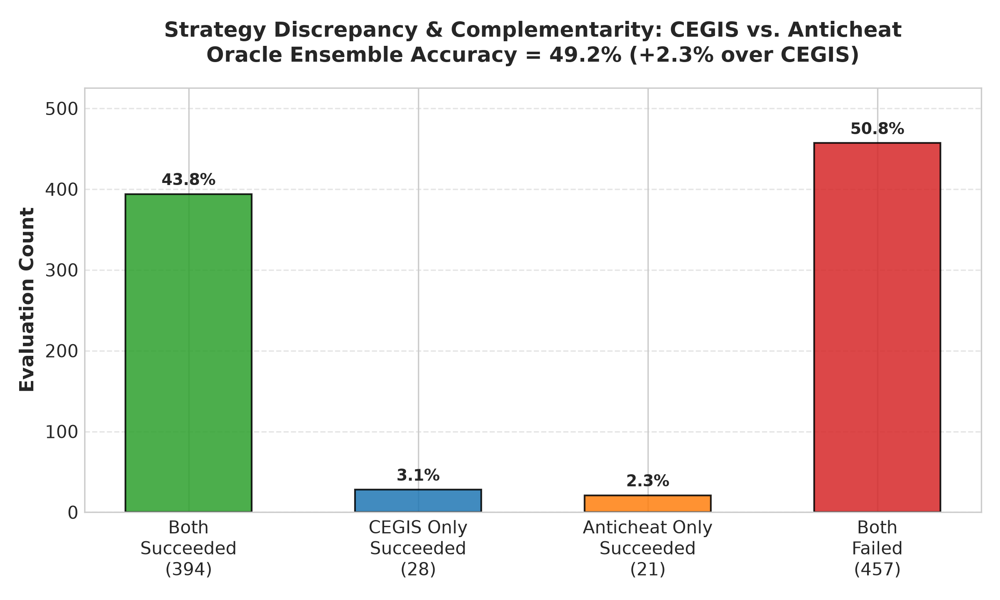

# ARC-AGI Static Analysis Report: Structural & Result-Independent Dynamics

> Auto-generated report synthesizing task topology, Guttman scaling, code complexity, iteration dynamics, and strategy complementarity.

## 1. Structural Overview

- **Total Benchmark Tasks**: 100
- **Total Evaluated Models**: 9
- **Universally Solved Tasks** (All models): **3** (3.0%)
- **Universally Unsolved Tasks** (0 models): **7** (7.0%)
- **Guttman Coefficient of Reproducibility (CR)**: **0.9689** (Threshold $\ge 0.90$)
- **Guttman Coefficient of Scalability (CS)**: **0.8511** (Threshold $\ge 0.60$)
- **Occam's Razor Bloat Factor**: **1.64x** longer code under spurious overfitting ($p = 1.92e-09$)
- **Recommended CEGIS Iteration Horizon**: **3 iterations** (captures **85.4%** of all recoveries)
- **Oracle Ensemble Accuracy (CEGIS + Anticheat)**: **49.2%** (+2.3% lift)

## 2. Task Topology: Universally Solved vs. Universally Unsolved

### Universally Solved Tasks (`3` tasks)
`0c786b71, 2072aba6, 332efdb3`

### Universally Unsolved Tasks (`7` tasks)
`0934a4d8, 0d87d2a6, 16b78196, 1acc24af, 1da012fc, 351d6448, 3ed85e70`

### Solve Count Frequency Distribution
| Models Solving | Task Count | Percentage | Visual Bar |
| :---: | :---: | :---: | :--- |
| 0 | 7 | 7.0% | `███████` |
| 1 | 5 | 5.0% | `█████` |
| 2 | 8 | 8.0% | `████████` |
| 3 | 15 | 15.0% | `███████████████` |
| 4 | 21 | 21.0% | `█████████████████████` |
| 5 | 11 | 11.0% | `███████████` |
| 6 | 21 | 21.0% | `█████████████████████` |
| 7 | 8 | 8.0% | `████████` |
| 8 | 1 | 1.0% | `█` |
| 9 | 3 | 3.0% | `███` |

### Inductive Trap Hotspots (Train Converged $\ge 50\%$, Test Solved $\le 1$ model)
| Task ID | Models Converged on Train | Models Passing Test | Train Convergence Rate |
| :---: | :---: | :---: | :---: |
| `351d6448` | 6/9 | 0/9 | 66.7% |
| `0d87d2a6` | 5/9 | 0/9 | 55.6% |
| `1da012fc` | 5/9 | 0/9 | 55.6% |

## 3. Guttman Subsumption Hierarchy & 1D Scalability

In an ideal Guttman scale, any task solved by a weaker model is monotonically subsumed by a stronger model.

### Consecutive Subsumption Chain $P(M_{i} \mid M_{i+1})$
| Stronger Model ($M_i$) | Weaker Model ($M_{i+1}$) | Subsumption Rate | Weaker Solved Count |
| :--- | :--- | :---: | :---: |
| `chigwell/grok-4.6` | `deepseek` | **100.0%** | 86 tasks |
| `deepseek` | `gpt-5.6-luna` | **97.4%** | 77 tasks |
| `gpt-5.6-luna` | `chigwell/claude-sonnet-5` | **91.9%** | 62 tasks |
| `chigwell/claude-sonnet-5` | `gemini-3.5-flash-lite` | **86.0%** | 43 tasks |
| `gemini-3.5-flash-lite` | `gemini-3.1-flash-lite` | **77.4%** | 31 tasks |
| `gemini-3.1-flash-lite` | `morriszdweck/glm-fast` | **68.4%** | 19 tasks |
| `morriszdweck/glm-fast` | `labs-leanstral-1-5-1` | **57.1%** | 7 tasks |
| `labs-leanstral-1-5-1` | `openai` | **80.0%** | 5 tasks |

### Psychometric Scalability Metrics
- **Coefficient of Reproducibility (CR)**: **0.9689** (Criterion $\ge 0.90$)
- **Minimum Marginal Reproducibility (MMR)**: **0.7911**
- **Coefficient of Scalability (CS)**: **0.8511** (Criterion $\ge 0.60$)
- **Valid 1-Dimensional Scale**: **CONFIRMED (Strong Scaling)**

## 4. Code Complexity & Occam's Razor Bloat Analysis

### Complexity by Evaluation Outcome
| Outcome Category | Sample Count | Mean SLOC | Mean Loops | Mean Ifs | Mean AST Depth |
| :--- | :---: | :---: | :---: | :---: | :---: |
| `both_correct` | 299 | **34.1** | 6.1 | 4.8 | 12.2 |
| `both_failed` | 395 | **46.0** | 8.0 | 7.6 | 12.7 |
| `semantic_recovery` | 123 | **43.3** | 7.4 | 6.8 | 12.6 |

### Failure Mode Breakdown
| Failure Type | Sample Count | Mean SLOC | Mean Loops | Mean Ifs | Mean Cyclomatic |
| :--- | :---: | :---: | :---: | :---: | :---: |
| `none` | 422 | **36.8** | 6.5 | 5.4 | 14.8 |
| `representation_ceiling` | 343 | **44.5** | 7.9 | 7.5 | 19.1 |
| `spurious_overfitting` | 52 | **55.9** | 8.8 | 8.7 | 21.4 |

> **Occam's Razor Law**: Programs that overfit the training demonstrations are **1.64x** longer than first-shot correct programs ($p = 1.92e-09$), adding ad-hoc branching conditionals to fit edge cases.

## 5. Iteration Convergence & Diminishing Returns

### Iteration Recovery Distribution
| Iteration | Tasks Solved | % of Solved | Recovered Tasks | % of Recoveries | Cumulative % Recoveries | Mean Latency |
| :---: | :---: | :---: | :---: | :---: | :---: | :---: |
| 1 | 299 | 70.9% | 0 | 0.0% | **0.0%** | 7.8s |
| 2 | 74 | 17.5% | 74 | 60.2% | **60.2%** | 80.6s |
| 3 | 31 | 7.3% | 31 | 25.2% | **85.4%** | 149.0s |
| 4 | 10 | 2.4% | 10 | 8.1% | **93.5%** | 98.4s |
| 5 | 8 | 1.9% | 8 | 6.5% | **100.0%** | 222.2s |

> **Horizon Optimization Recommendation**: Setting the CEGIS horizon to **3 iterations** captures **85.4%** of all possible semantic repairs while discarding the long-tail latency bottleneck.

## 6. Strategy Complementarity: CEGIS vs. Anticheat

### Contingency Matrix
- **Both Succeeded**: 394 (43.8%)
- **CEGIS Only Succeeded**: 28 (3.1%)
- **Anticheat Only Succeeded**: 21 (2.3%)
- **Both Failed**: 457 (50.8%)
- **Jaccard Index**: **0.8894** | **Cohen's Kappa**: **0.8906**

### Oracle Ensemble Upper Bound
- **CEGIS Standalone Accuracy**: 46.9%
- **Anticheat Standalone Accuracy**: 46.1%
- **Oracle Ensemble Accuracy**: **49.2%** (Lift: **+2.3%**)

## 7. Static Code Scanner: Coordinate Leakage & Cheating

- **Total Code Snippets Scanned**: 2697
- **Flagged Snippets with Hardcoded Coordinates**: **7** (0.26%)

### Breakdown by Strategy
- `cegis`: 5 snippets
- `baseline`: 2 snippets
