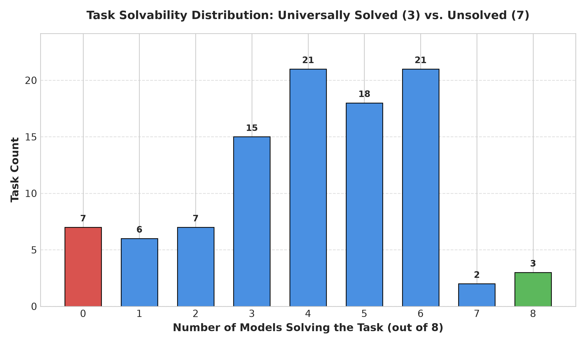
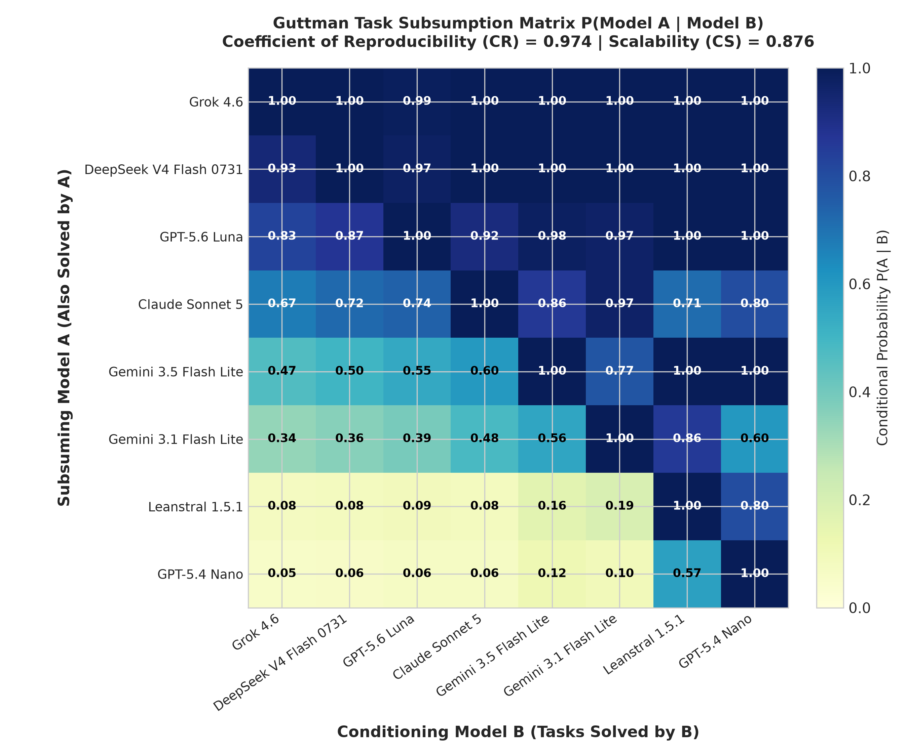
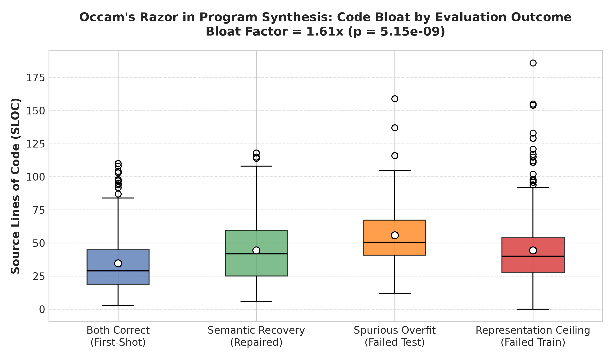
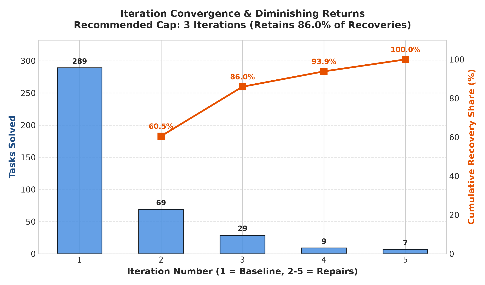
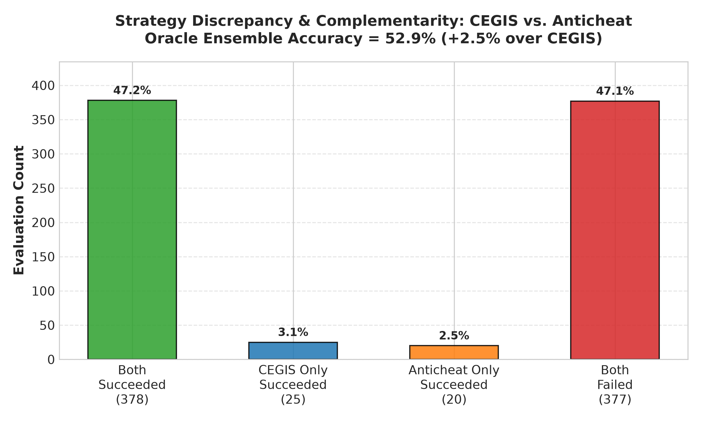

# ARC-AGI Static Analysis Report: Structural & Result-Independent Dynamics

> Auto-generated report synthesizing task topology, Guttman scaling, code complexity, iteration dynamics, and strategy complementarity.

## 1. Structural Overview

- **Total Benchmark Tasks**: 100
- **Total Evaluated Models**: 8
- **Universally Solved Tasks** (All models): **3** (3.0%)
- **Universally Unsolved Tasks** (0 models): **7** (7.0%)
- **Guttman Coefficient of Reproducibility (CR)**: **0.9738** (Threshold $\ge 0.90$)
- **Guttman Coefficient of Scalability (CS)**: **0.8757** (Threshold $\ge 0.60$)
- **Occam's Razor Bloat Factor**: **1.61x** longer code under spurious overfitting ($p = 5.15e-09$)
- **Recommended CEGIS Iteration Horizon**: **3 iterations** (captures **86.0%** of all recoveries)
- **Oracle Ensemble Accuracy (CEGIS + Anticheat)**: **52.9%** (+2.5% lift)

## 2. Task Topology: Universally Solved vs. Universally Unsolved

### Universally Solved Tasks (`3` tasks)
`0c786b71, 2072aba6, 332efdb3`

### Universally Unsolved Tasks (`7` tasks)
`0934a4d8, 0d87d2a6, 16b78196, 1acc24af, 1da012fc, 351d6448, 3ed85e70`

### Solve Count Frequency Distribution
| Models Solving | Task Count | Percentage | Visual Bar |
| :---: | :---: | :---: | :--- |
| 0 | 7 | 7.0% | `███████` |
| 1 | 6 | 6.0% | `██████` |
| 2 | 7 | 7.0% | `███████` |
| 3 | 15 | 15.0% | `███████████████` |
| 4 | 21 | 21.0% | `█████████████████████` |
| 5 | 18 | 18.0% | `██████████████████` |
| 6 | 21 | 21.0% | `█████████████████████` |
| 7 | 2 | 2.0% | `██` |
| 8 | 3 | 3.0% | `███` |

### Inductive Trap Hotspots (Train Converged $\ge 50\%$, Test Solved $\le 1$ model)
| Task ID | Models Converged on Train | Models Passing Test | Train Convergence Rate |
| :---: | :---: | :---: | :---: |
| `351d6448` | 6/8 | 0/8 | 75.0% |
| `0d87d2a6` | 5/8 | 0/8 | 62.5% |
| `11e1fe23` | 5/8 | 1/8 | 62.5% |
| `1da012fc` | 5/8 | 0/8 | 62.5% |
| `25094a63` | 4/8 | 1/8 | 50.0% |

## 3. Guttman Subsumption Hierarchy & 1D Scalability

In an ideal Guttman scale, any task solved by a weaker model is monotonically subsumed by a stronger model.

### Consecutive Subsumption Chain $P(M_{i} \mid M_{i+1})$
| Stronger Model ($M_i$) | Weaker Model ($M_{i+1}$) | Subsumption Rate | Weaker Solved Count |
| :--- | :--- | :---: | :---: |
| `Grok 4.6` | `DeepSeek V4 Flash 0731` | **100.0%** | 86 tasks |
| `DeepSeek V4 Flash 0731` | `GPT-5.6 Luna` | **97.4%** | 77 tasks |
| `GPT-5.6 Luna` | `Claude Sonnet 5` | **91.9%** | 62 tasks |
| `Claude Sonnet 5` | `Gemini 3.5 Flash Lite` | **86.0%** | 43 tasks |
| `Gemini 3.5 Flash Lite` | `Gemini 3.1 Flash Lite` | **77.4%** | 31 tasks |
| `Gemini 3.1 Flash Lite` | `Leanstral 1.5.1` | **85.7%** | 7 tasks |
| `Leanstral 1.5.1` | `GPT-5.4 Nano` | **80.0%** | 5 tasks |

### Psychometric Scalability Metrics
- **Coefficient of Reproducibility (CR)**: **0.9738** (Criterion $\ge 0.90$)
- **Minimum Marginal Reproducibility (MMR)**: **0.7887**
- **Coefficient of Scalability (CS)**: **0.8757** (Criterion $\ge 0.60$)
- **Valid 1-Dimensional Scale**: **CONFIRMED (Strong Scaling)**

## 4. Code Complexity & Occam's Razor Bloat Analysis

### Complexity by Evaluation Outcome
| Outcome Category | Sample Count | Mean SLOC | Mean Loops | Mean Ifs | Mean AST Depth |
| :--- | :---: | :---: | :---: | :---: | :---: |
| `both_correct` | 289 | **34.6** | 6.2 | 4.9 | 12.2 |
| `both_failed` | 394 | **45.9** | 8.0 | 7.6 | 12.7 |
| `semantic_recovery` | 114 | **44.5** | 7.6 | 7.0 | 12.7 |

### Failure Mode Breakdown
| Failure Type | Sample Count | Mean SLOC | Mean Loops | Mean Ifs | Mean Cyclomatic |
| :--- | :---: | :---: | :---: | :---: | :---: |
| `none` | 403 | **37.4** | 6.6 | 5.5 | 15.0 |
| `representation_ceiling` | 342 | **44.4** | 7.9 | 7.5 | 19.1 |
| `spurious_overfitting` | 52 | **55.9** | 8.8 | 8.7 | 21.4 |

> **Occam's Razor Law**: Programs that overfit the training demonstrations are **1.61x** longer than first-shot correct programs ($p = 5.15e-09$), adding ad-hoc branching conditionals to fit edge cases.

## 5. Iteration Convergence & Diminishing Returns

### Iteration Recovery Distribution
| Iteration | Tasks Solved | % of Solved | Recovered Tasks | % of Recoveries | Cumulative % Recoveries | Mean Latency |
| :---: | :---: | :---: | :---: | :---: | :---: | :---: |
| 1 | 289 | 71.7% | 0 | 0.0% | **0.0%** | 7.8s |
| 2 | 69 | 17.1% | 69 | 60.5% | **60.5%** | 67.6s |
| 3 | 29 | 7.2% | 29 | 25.4% | **86.0%** | 147.2s |
| 4 | 9 | 2.2% | 9 | 7.9% | **93.9%** | 89.7s |
| 5 | 7 | 1.7% | 7 | 6.1% | **100.0%** | 226.6s |

> **Horizon Optimization Recommendation**: Setting the CEGIS horizon to **3 iterations** captures **86.0%** of all possible semantic repairs while discarding the long-tail latency bottleneck.

## 6. Strategy Complementarity: CEGIS vs. Anticheat

### Contingency Matrix
- **Both Succeeded**: 378 (47.2%)
- **CEGIS Only Succeeded**: 25 (3.1%)
- **Anticheat Only Succeeded**: 20 (2.5%)
- **Both Failed**: 377 (47.1%)
- **Jaccard Index**: **0.8936** | **Cohen's Kappa**: **0.8875**

### Oracle Ensemble Upper Bound
- **CEGIS Standalone Accuracy**: 50.4%
- **Anticheat Standalone Accuracy**: 49.8%
- **Oracle Ensemble Accuracy**: **52.9%** (Lift: **+2.5%**)

## 7. Static Code Scanner: Coordinate Leakage & Cheating

- **Total Code Snippets Scanned**: 2398
- **Flagged Snippets with Hardcoded Coordinates**: **7** (0.29%)

### Breakdown by Strategy
- `cegis`: 5 snippets
- `baseline`: 2 snippets
