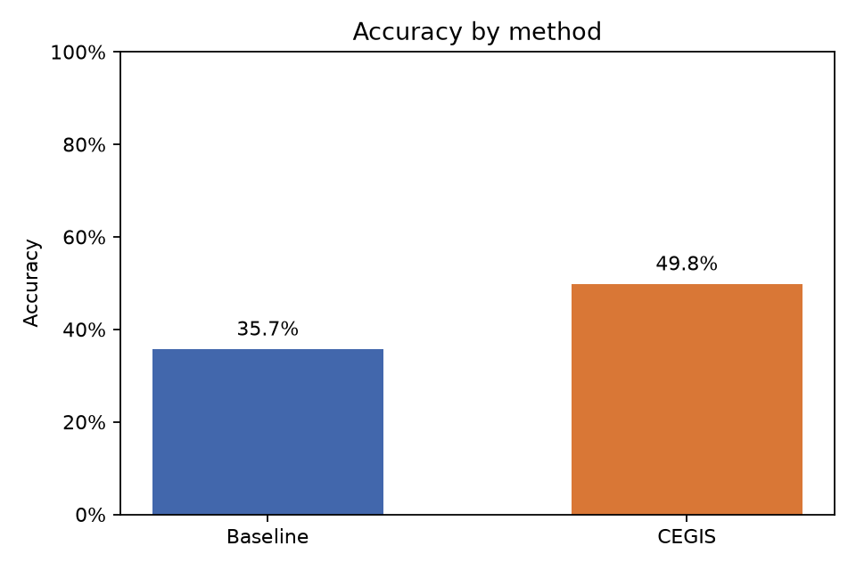
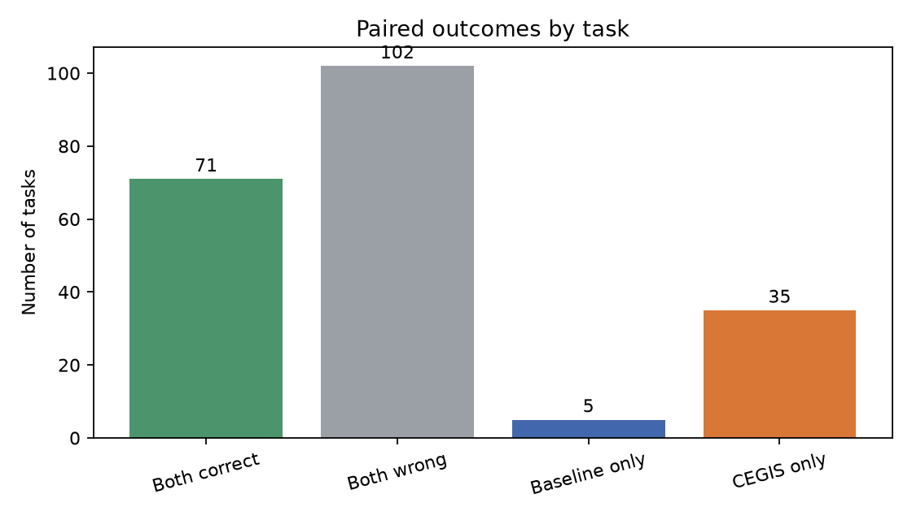

# Baseline vs. CEGIS

Análise pareada de **213 tarefas**, com α = 0.05.

- Baseline: 35.7% (76/213)
- CEGIS: 49.8% (106/213)
- Diferença CEGIS − Baseline: 14.1%
- Pares discordantes: baseline apenas = 5; CEGIS apenas = 35
- McNemar exato bilateral (diferença entre métodos): p = 0.0000; H0 **rejeitada**
- Bootstrap pareado unilateral (CEGIS melhor): p = 0.0001; H0 **rejeitada**
- IC bootstrap de 95% para a diferença: [8.9%, 19.7%]

## Plots

