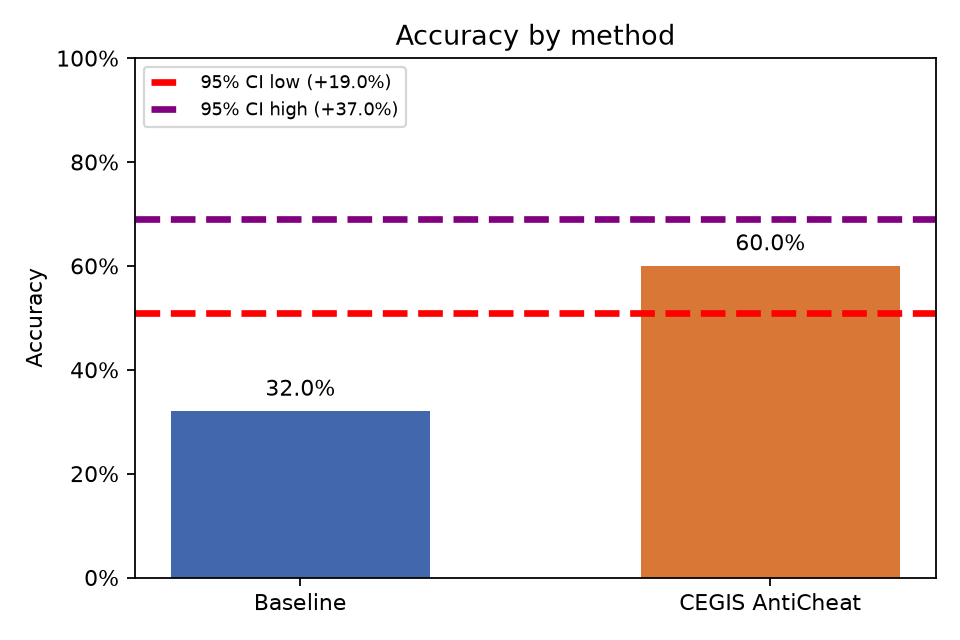
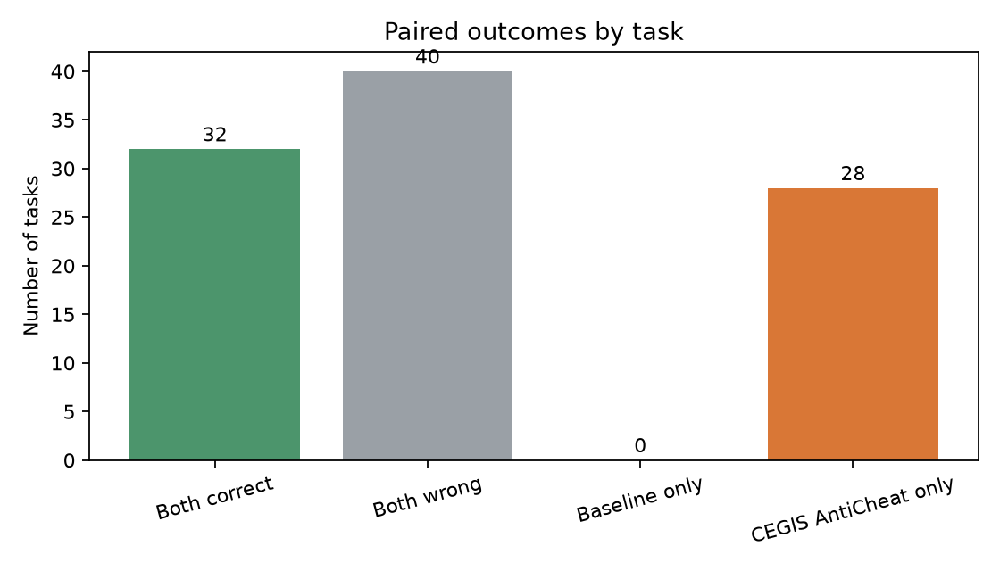

# Baseline vs. CEGIS AntiCheat

Análise pareada de **100 tarefas**, com α = 0.05.

- Baseline: 32.0% (32/100)
- CEGIS AntiCheat: 60.0% (60/100)
- Diferença CEGIS AntiCheat − Baseline: 28.0%
- Permutação pareada unilateral (H0: sem diferença de acurácia): p = 0.0001; H0 **rejeitada**
- Bootstrap pareado unilateral (CEGIS AntiCheat melhor): p = 0.0001; H0 **rejeitada**
- IC bootstrap de 95% para a diferença: [19.0%, 37.0%]

## Plots

