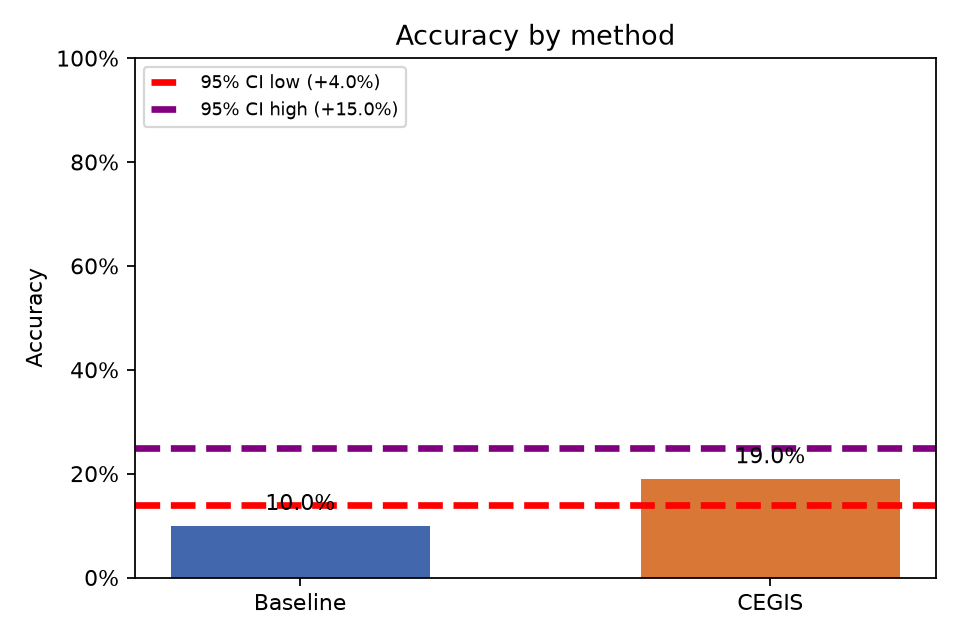
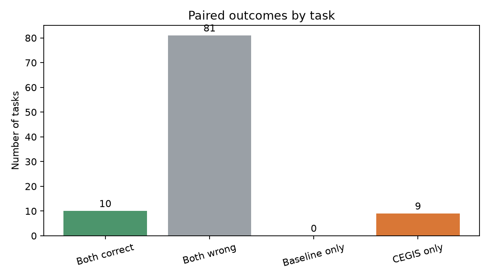

# Baseline vs. CEGIS

Análise pareada de **100 tarefas**, com α = 0.05.

- Baseline: 10.0% (10/100)
- CEGIS: 19.0% (19/100)
- Diferença CEGIS − Baseline: 9.0%
- Permutação pareada unilateral (H0: sem diferença de acurácia): p = 0.0012; H0 **rejeitada**
- Bootstrap pareado unilateral (CEGIS melhor): p = 0.0052; H0 **rejeitada**
- IC bootstrap de 95% para a diferença: [4.0%, 15.0%]

## Plots

