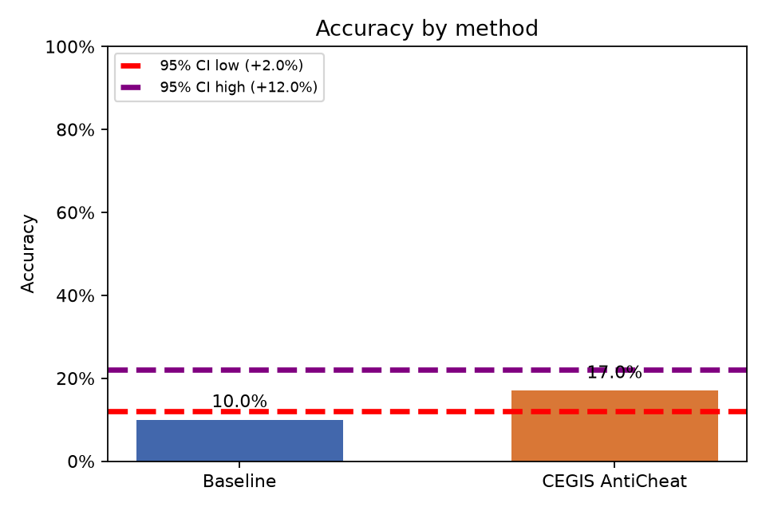
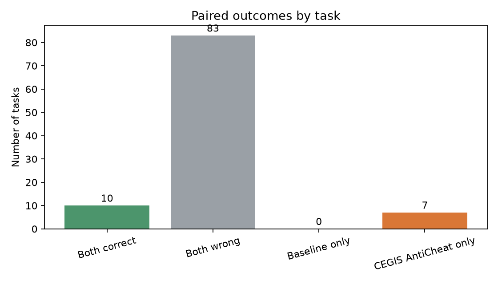

# Baseline vs. CEGIS AntiCheat

Análise pareada de **100 tarefas**, com α = 0.05.

- Baseline: 10.0% (10/100)
- CEGIS AntiCheat: 17.0% (17/100)
- Diferença CEGIS AntiCheat − Baseline: 7.0%
- Permutação pareada unilateral (H0: sem diferença de acurácia): p = 0.0087; H0 **rejeitada**
- Bootstrap pareado unilateral (CEGIS AntiCheat melhor): p = 0.0113; H0 **rejeitada**
- IC bootstrap de 95% para a diferença: [2.0%, 12.0%]

## Plots

