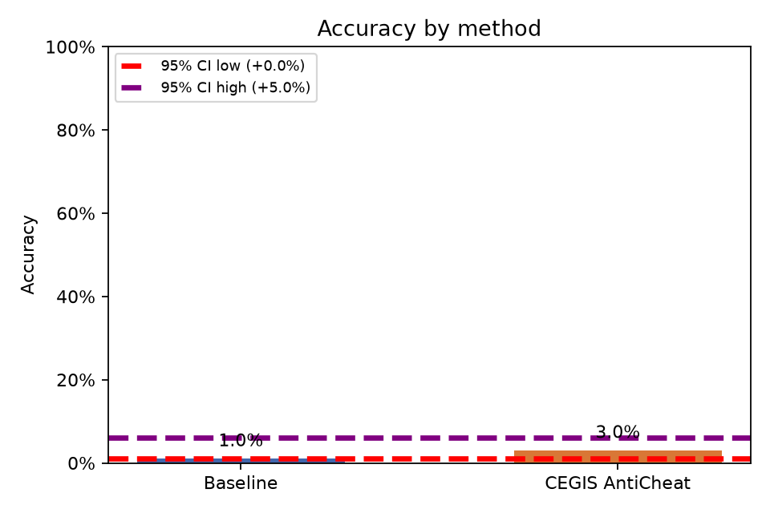
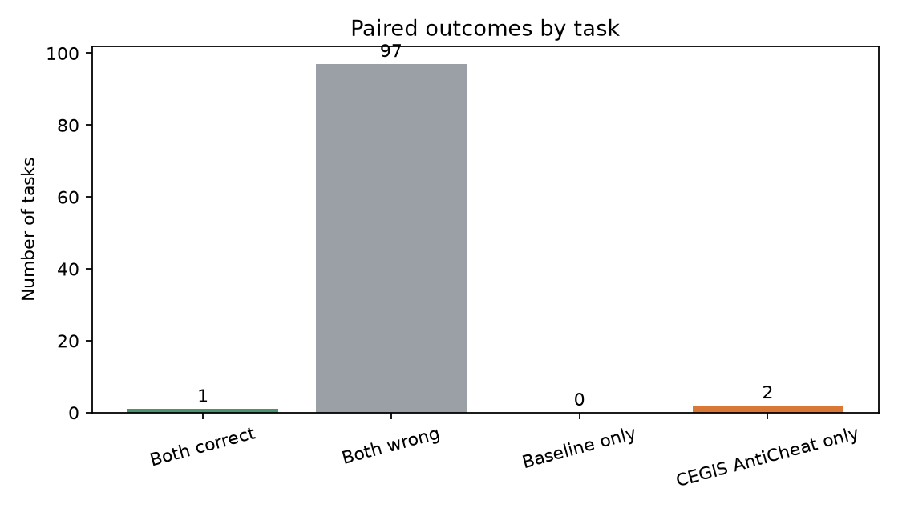

# Baseline vs. CEGIS AntiCheat

Análise pareada de **100 tarefas**, com α = 0.05.

- Baseline: 1.0% (1/100)
- CEGIS AntiCheat: 3.0% (3/100)
- Diferença CEGIS AntiCheat − Baseline: 2.0%
- Permutação pareada unilateral (H0: sem diferença de acurácia): p = 0.2504; H0 **não rejeitada**
- Bootstrap pareado unilateral (CEGIS AntiCheat melhor): p = 0.1397; H0 **não rejeitada**
- IC bootstrap de 95% para a diferença: [0.0%, 5.0%]

## Plots

