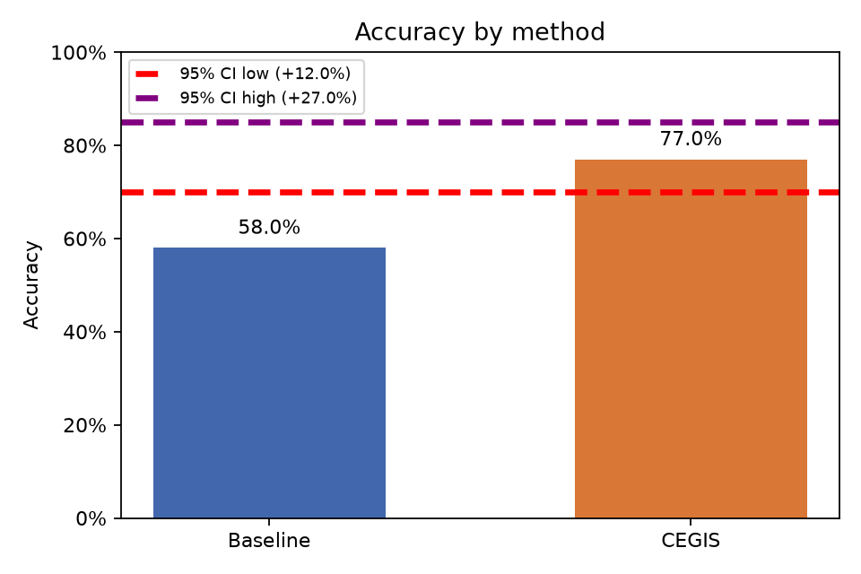
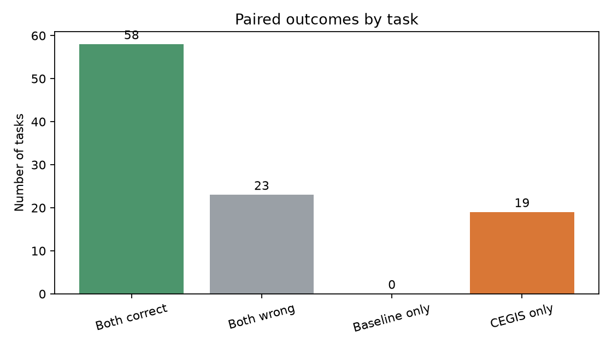

# Baseline vs. CEGIS

Análise pareada de **100 tarefas**, com α = 0.05.

- Baseline: 58.0% (58/100)
- CEGIS: 77.0% (77/100)
- Diferença CEGIS − Baseline: 19.0%
- Permutação pareada unilateral (H0: sem diferença de acurácia): p = 0.0001; H0 **rejeitada**
- Bootstrap pareado unilateral (CEGIS melhor): p = 0.0001; H0 **rejeitada**
- IC bootstrap de 95% para a diferença: [12.0%, 27.0%]

## Plots

