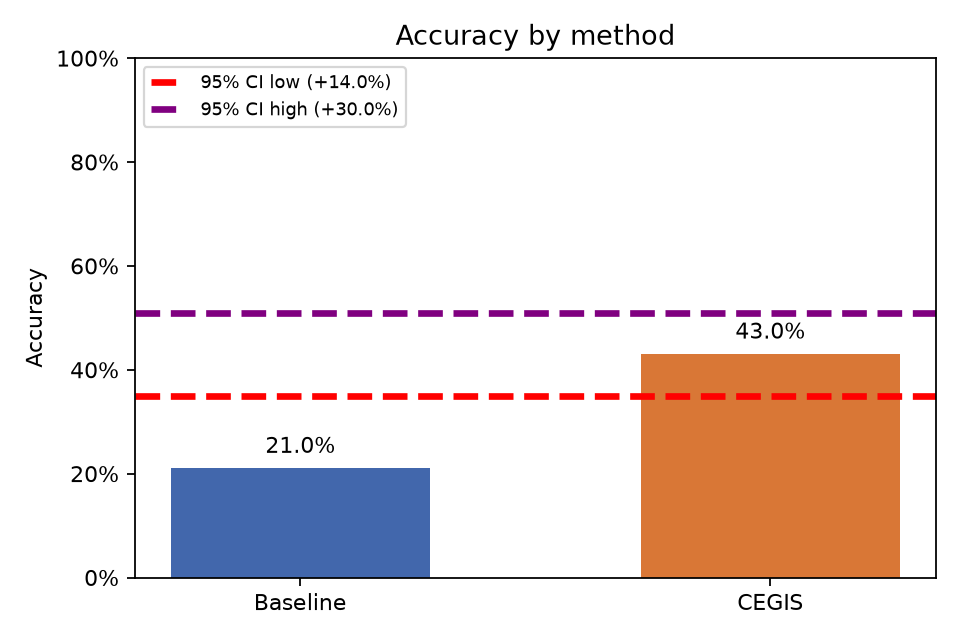
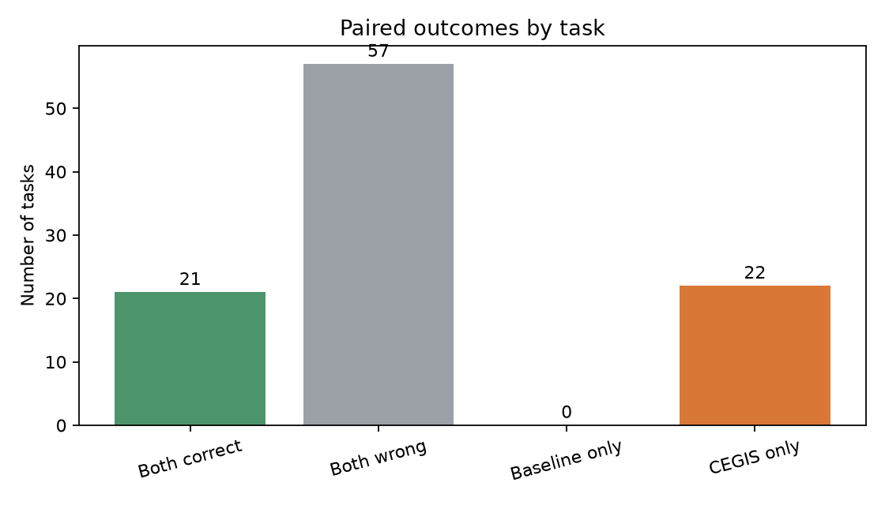

# Baseline vs. CEGIS

Análise pareada de **100 tarefas**, com α = 0.05.

- Baseline: 21.0% (21/100)
- CEGIS: 43.0% (43/100)
- Diferença CEGIS − Baseline: 22.0%
- Permutação pareada unilateral (H0: sem diferença de acurácia): p = 0.0001; H0 **rejeitada**
- Bootstrap pareado unilateral (CEGIS melhor): p = 0.0001; H0 **rejeitada**
- IC bootstrap de 95% para a diferença: [14.0%, 30.0%]

## Plots

