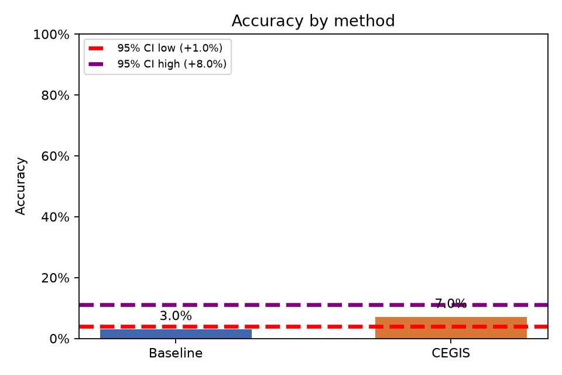
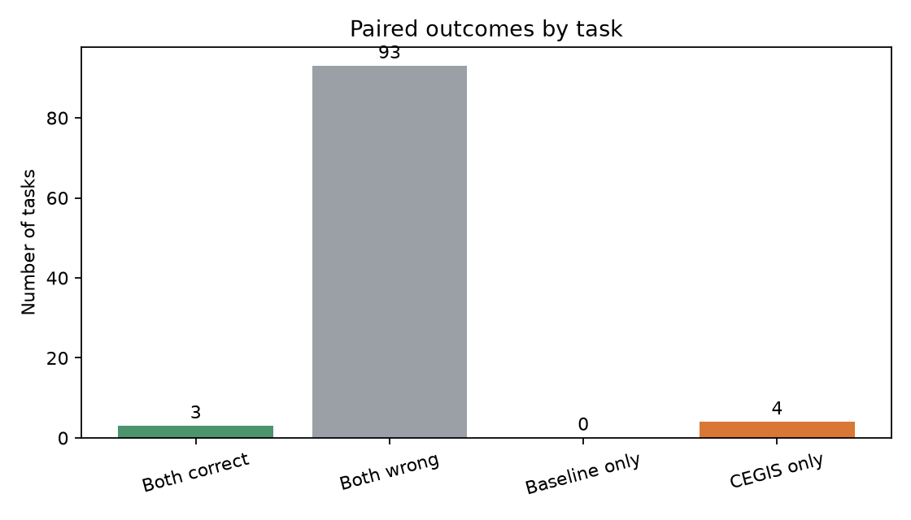

# Baseline vs. CEGIS

Análise pareada de **100 tarefas**, com α = 0.05.

- Baseline: 3.0% (3/100)
- CEGIS: 7.0% (7/100)
- Diferença CEGIS − Baseline: 4.0%
- Permutação pareada unilateral (H0: sem diferença de acurácia): p = 0.0603; H0 **não rejeitada**
- Bootstrap pareado unilateral (CEGIS melhor): p = 0.0457; H0 **rejeitada**
- IC bootstrap de 95% para a diferença: [1.0%, 8.0%]

## Plots

