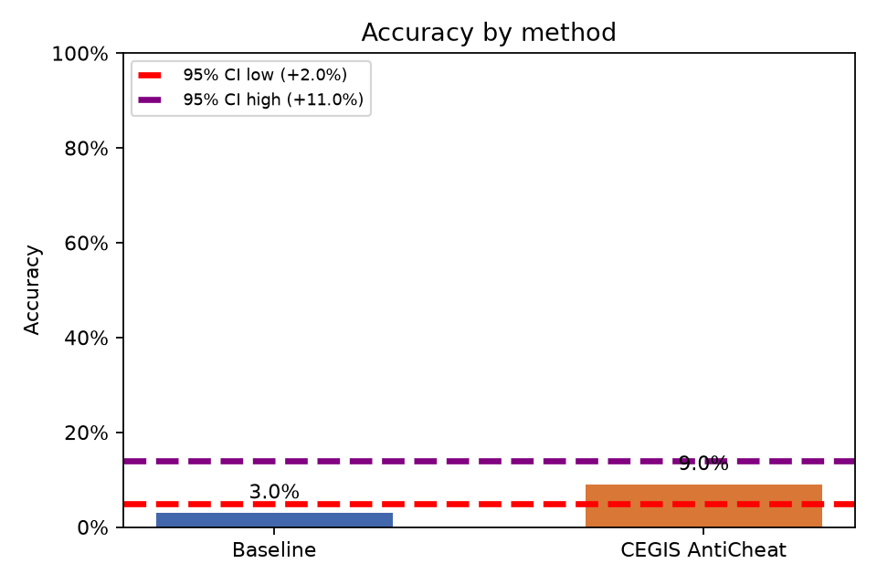
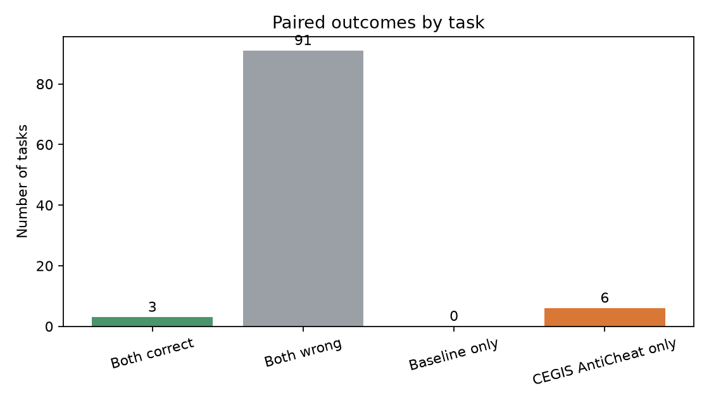

# Baseline vs. CEGIS AntiCheat

Análise pareada de **100 tarefas**, com α = 0.05.

- Baseline: 3.0% (3/100)
- CEGIS AntiCheat: 9.0% (9/100)
- Diferença CEGIS AntiCheat − Baseline: 6.0%
- Permutação pareada unilateral (H0: sem diferença de acurácia): p = 0.0169; H0 **rejeitada**
- Bootstrap pareado unilateral (CEGIS AntiCheat melhor): p = 0.0162; H0 **rejeitada**
- IC bootstrap de 95% para a diferença: [2.0%, 11.0%]

## Plots

